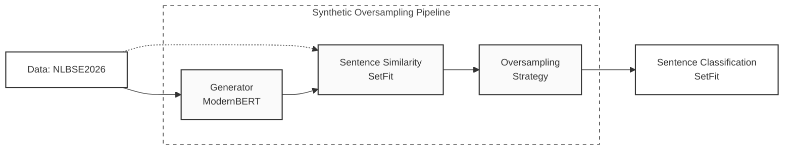
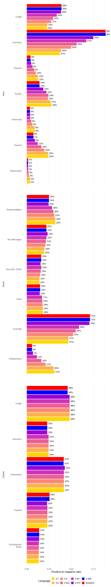
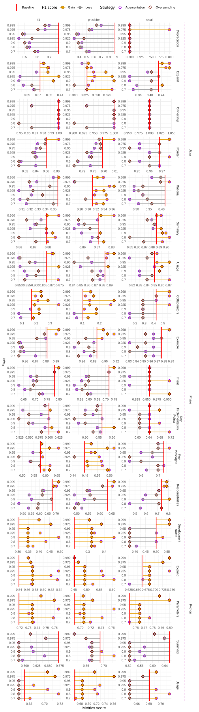

<div align="center">

# High-quality data augmentation for code comment classification.

<a href="https://pytorch.org/get-started/locally/"></a>
<a href="https://hydra.cc/"></a>
<a href="https://huggingface.co/username/finetuned-model">
  
</a>

[](https://nlbse2026.github.io/index.html)
[](https://github.com/ashleve/lightning-hydra-template#license)

</div>

## Description

[NLBSE tool competition 2026](https://nlbse2026.github.io/tools/) 

The following figure depicts the application architecture in terms of components and data flows (solid links):



## Installation

#### Pip

```bash
cd NLBSE26

# [OPTIONAL] create conda environment
python -m venv venv
source venv/bin/activate  

# install requirements
pip install -U pip
pip install -r requirements.txt  
```

## How to run

Run the Synthetic Oversampling Pipeline with default configuration presented in the result section ( MTL model head with Data Augmentation pipeline)

```bash
python src/main.py 
```

Run the Synthetic Oversampling Pipeline with chosen experiment configuration from [configs/experiment/](configs/experiment/)

```bash
python src/main.py experiment=experiment_name.yaml
```

### Example

Using the `setfitlinear.yaml` configuration:

```yaml
_target_: src.pipeline.pipeline           # Entry point for running the experiment

defaults:
  - /component/augment: SyntheticData     # Synthetic data generation
  - /component/finetune: ModernBERT       # Generator finetuning
  - /component/classifier: SetFitLinear   # Main classifier
  - /component/evaluation: SetFitLinear   # Evaluation configuration
  - /component/balancer: BalancerRatio    # Balancer type

trainer:                                  # Dataset configuration
  SYNQ: 0.99
  ValidationSize: 0.2

component:                                # Easy access to component-level hyperparameters
  augment:
    augments: 10
    ntop: 20

  finetune:
    batch_size: 64
    learning_rate: 2e-5
    weight_decay: 0.01
    mlm_probability: 0.15

  classifier:
    batch_size: 32
    num_iterations: 20
```

### Override any parameter from the command line

All configuration parameters can be overridden directly via CLI:

```bash
python src/main.py trainer.SYNQ=0.5  component.balancer=BalancerRatio
```

## Project Structure

The directory structure of the project:

```
├── .github                   <- Github Actions workflows
│
├── configs                   <- Hydra configs
│   ├── component                <- Callbacks configs
|   |   ├── augment                 <- Data augmentation configs
|   |   ├── balancer                <- Balancing strategy configs
|   |   ├── classifier              <- Final classifier configs
|   |   ├── finetue                 <- Generative model configs
│   ├── experiment               <- Experiment configs
│   ├── extras                   <- Extra utilities configs
│   ├── hydra                    <- Hydra configs
│   ├── logger                   <- Logger configs
│   ├── paths                    <- Project paths configs
│   │
│   └── train.yaml            <- Main config for training
│
├── data                   <- Data generate from Augmentation Component
|
├── results                <- Results of the fine code comment classification
|
├── logs                   <- Logs generated by hydra loggers
│
├── notebooks              <- Jupyter notebooks. 
│
├── scripts                <- Shell scripts to run the experiment
│
├── src                    <- Source code
│   ├── balancer                 <- Balancer scripts
│   ├── models                   <- Model scripts
│   ├── utils                    <- Utility scripts
│   │
│   └── main.py                 <- Run Synthetic data augmentation Pipeline
│
├── tests                  <- Tests of any kind
│
├── .env.example              <- Example of file for storing private environment variables
├── .gitignore                <- List of files ignored by git
├── .project-root             <- File for inferring the position of project root directory
├── Makefile                  <- Makefile with commands like `make main` 
├── requirements.txt          <- File for installing python dependencies
└── README.md
```
## Extra Visualisation of the Results

Proportion of positive synthetic observations included in the dataset at different levels of $q_{synt}$:

<div align="center">

</div>

Variation in precision, recall, and F1-score relative to the baseline for each class, evaluated across multiple values of $q_{synt}$:

<div align="center">

</div>