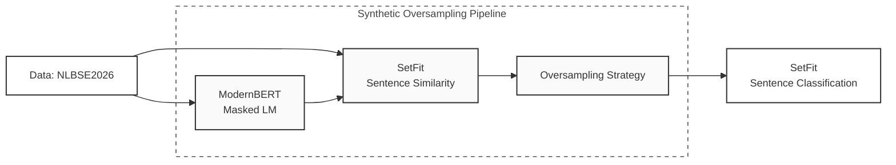

<div align="center">

# Synthetic Oversampling in Code Comment Classification

<a href="https://pytorch.org/get-started/locally/"></a>
<a href="https://hydra.cc/"></a>
[](https://www.nature.com/articles/nature14539)
[](https://papers.nips.cc/paper/2020)
[](https://github.com/ashleve/lightning-hydra-template#license)

</div>

## Description

[NLBSE tool competition 2026](https://nlbse2026.github.io/tools/) 

The following figure depicts the application architecture in terms of components, data flows (solid links):



## Installation

#### Pip

```bash
cd NLBSE26

# [OPTIONAL] create conda environment
python -m venv venv
source venv/bin/activate  

# install requirements
pip install -U pip
pip install -r requirements.txt  
```

## How to run

Run the Synthetic Oversampling Pipeline with default configuration

```bash
python src/main.py 
```

Run the Synthetic Oversampling Pipeline with chosen experiment configuration from [configs/experiment/](configs/experiment/)

```bash
python src/train.py experiment=experiment_name.yaml
```

You can override any parameter from command line like this

```bash
python src/train.py trainer.SYNQ=0.5 
```

## Project Structure

The directory structure of the project:

```
├── .github                   <- Github Actions workflows
│
├── configs                   <- Hydra configs
│   ├── component                <- Callbacks configs
|   |   ├── augment                 <- Data augmentation configs
|   |   ├── balancer                <- Balancing strategy configs
|   |   ├── classifier              <- Final classifier configs
|   |   ├── finetue                 <- Generative model configs
│   ├── experiment               <- Experiment configs
│   ├── extras                   <- Extra utilities configs
│   ├── hydra                    <- Hydra configs
│   ├── logger                   <- Logger configs
│   ├── paths                    <- Project paths configs
│   │
│   └── train.yaml            <- Main config for training
│
├── logs                   <- Logs generated by hydra loggers
│
├── notebooks              <- Jupyter notebooks. 
│
├── scripts                <- Shell scripts to run the experiment
│
├── src                    <- Source code
│   ├── balancer                 <- Balancer scripts
│   ├── models                   <- Model scripts
│   ├── utils                    <- Utility scripts
│   │
│   └── main.py                 <- Run Synthetic data augmentation Pipeline
│
├── tests                  <- Tests of any kind
│
├── .env.example              <- Example of file for storing private environment variables
├── .gitignore                <- List of files ignored by git
├── .project-root             <- File for inferring the position of project root directory
├── Makefile                  <- Makefile with commands like `make main` 
├── requirements.txt          <- File for installing python dependencies
└── README.md
```

<br>